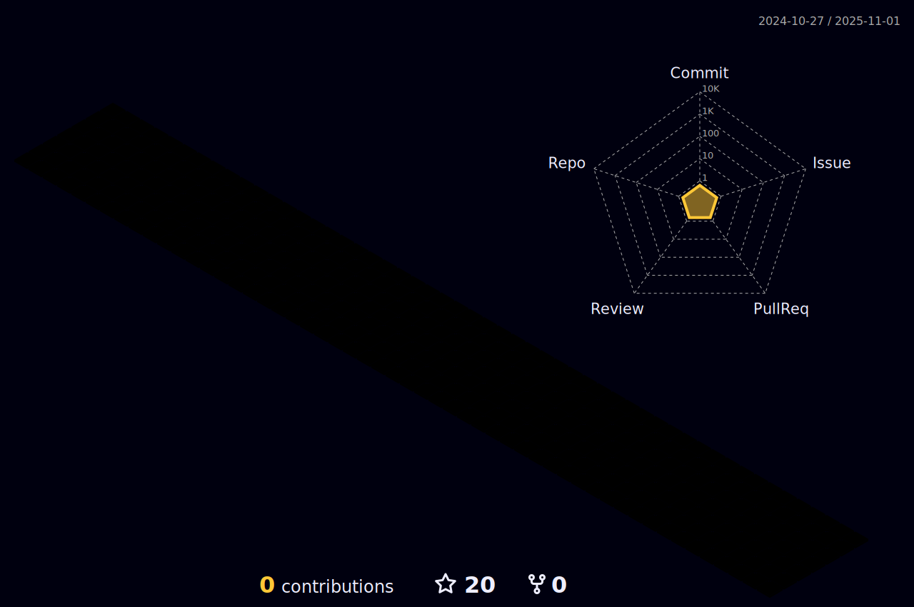

<h1 align="center">Hi 👋,you! I'm Kévin Francisco Welcome to my GitHub profile</h1>
<h2 align="center">I am a backend web developer specializing in PHP/Symfony From   
  
To know more about me, go to see my website: <a href="https://kevin-francisco.fr/">https://kevin-francisco.fr/</a>
</h2>

<h3 align="center">New challenge of the year 2022, solve one algorithm per day</h3> 
<h3 align="left">Last informations 🧐</h3>

- 🔭 Currently I am looking for a dev job opportunity.

- ‍💻 Currently I am create a web application with current covid statistics

- ‍💻 Currently I am training in algorithms on Codewars

- 🔭 My last completed project [maBoutiqueOfficielle](https://maboutiqueofficielle.herokuapp.com/)

- 📫 How to reach me **kevin.francisco@hotmail.fr**

<h3 align="left">Connect with me:</h3>

<h3 align="left">Languages and tools i use:</h3>

 
 

 

<a href="https://git-scm.com/" target="_blank" rel="noreferrer"><a>
<a href="https://github.com/" target="_blank" rel="noreferrer"><a>

 

 
<h3 align="left">Contributions 🔰</h3>

 <h3>Github Stats 🧐</h3>
 

